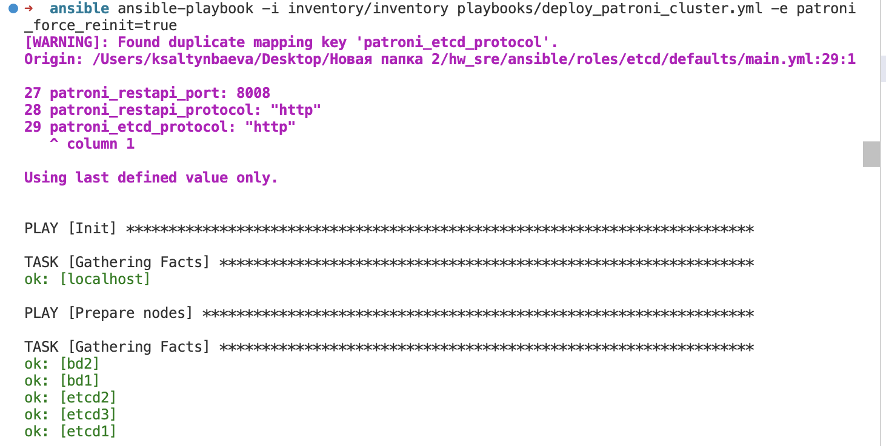
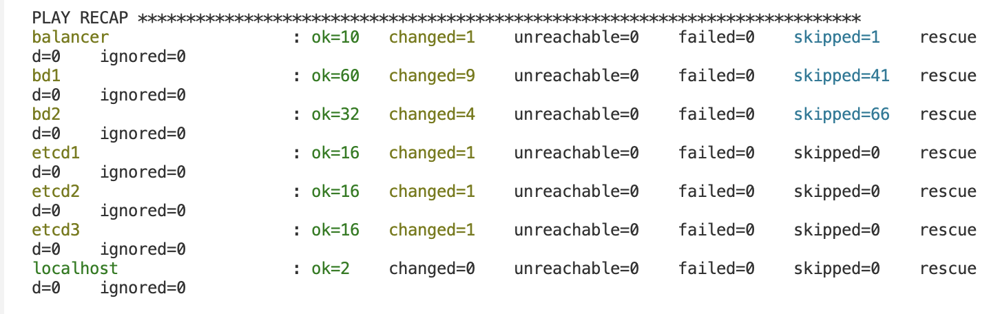
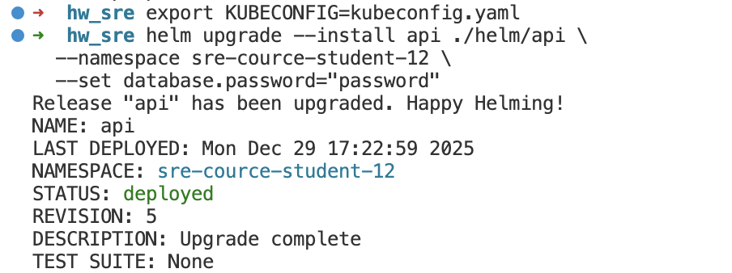
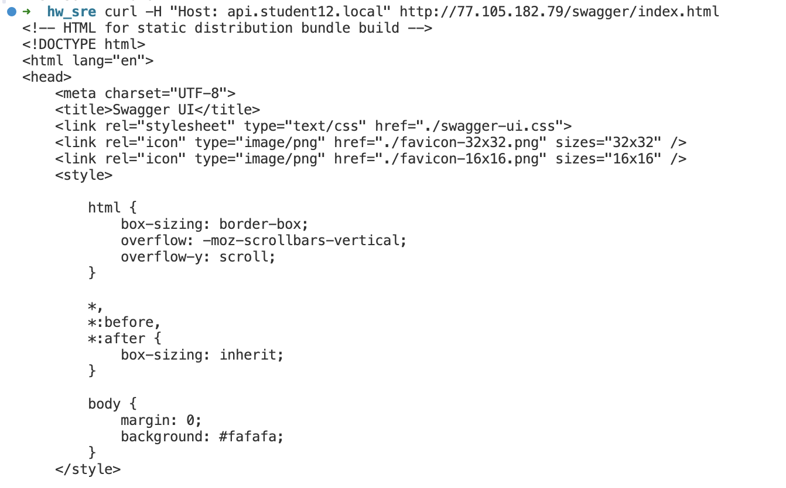
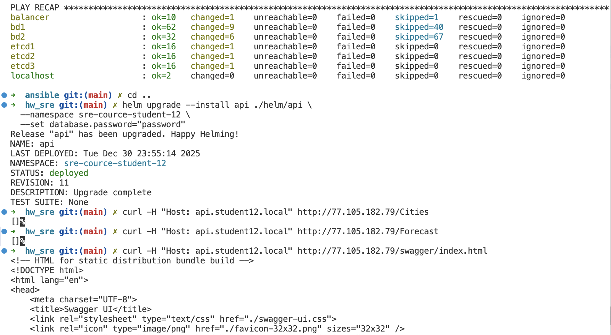

## Как запустить

### PostgreSQL

```bash

export PATRONI_REPLICATION_PASSWORD="password"
export API_DATABASE_PASSWORD="password"
export PATRONI_SUPERUSER_PASSWORD="password"

cd ansible

ansible-playbook -i inventory/inventory playbooks/deploy_patroni_cluster.yml -e patroni_force_reinit=true
```





### Kubernetes

```bash
export KUBECONFIG=kubeconfig.yaml

helm upgrade --install api ./helm/api \
  --namespace sre-cource-student-12 \
  --set database.password="password"
```




## Результат
```bash
curl -H "Host: api.student12.local" http://77.105.182.79/swagger/index.html
```



